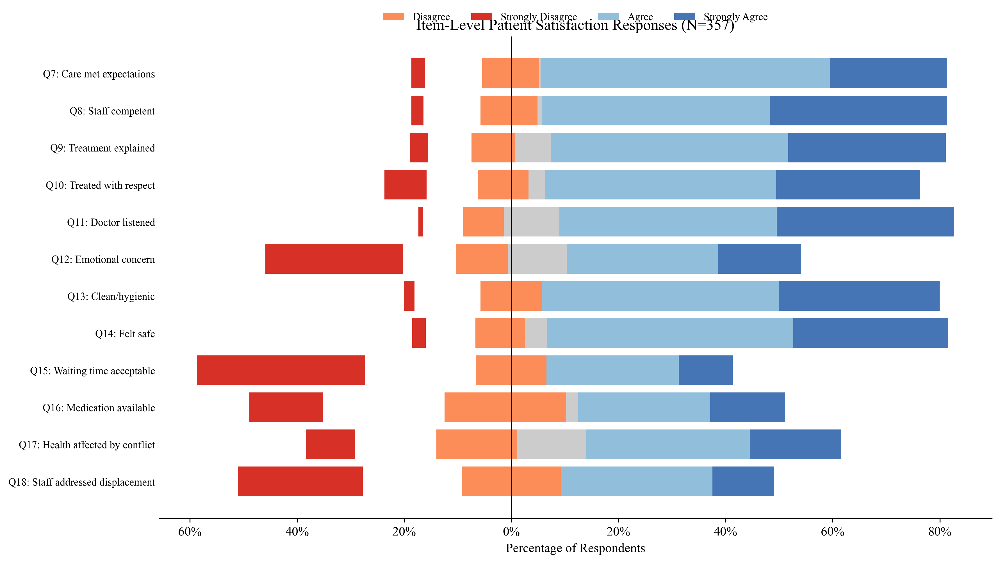
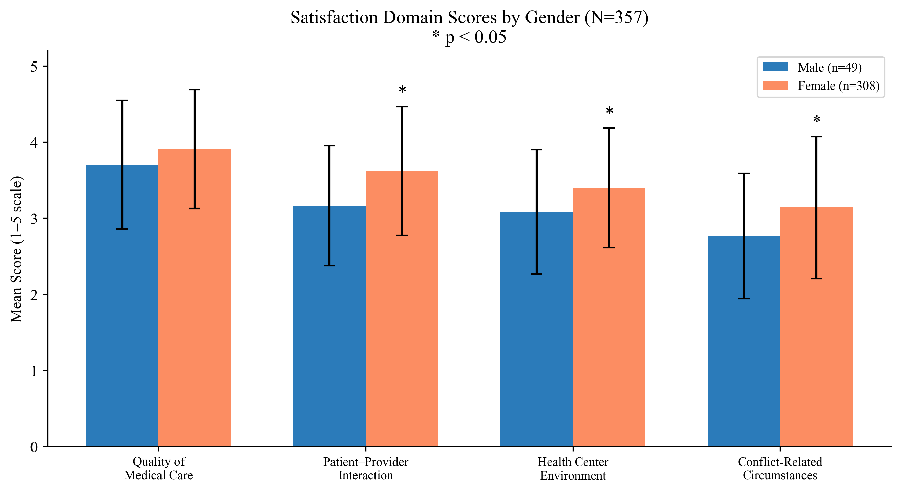
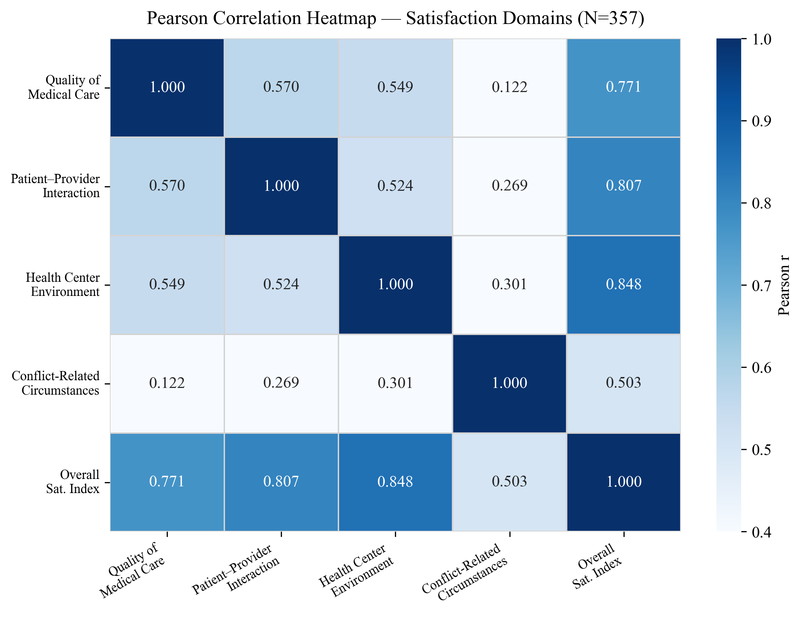

# Patient Satisfaction in Primary Healthcare Settings During the War in Sudan — Eleskan75 Center, 2025

**Study type:** Cross-sectional, institution-based descriptive study

**Degree level:** Clinical MD Degree in Family Medicine

**Institution:** Sudan Medical Specializations Board

**Sample size:** N = 357 patients

**Data analyst:** Abdulrahman Sirelkhatim

---

## Background

The ongoing armed conflict in Sudan, which escalated dramatically in April 2023, has caused
one of the world's most acute humanitarian crises. Khartoum State — the country's political
and demographic centre — suffered extensive infrastructure damage, mass displacement, and the
near-collapse of public health services. In this context, primary healthcare facilities have
become the first and often the only point of contact between conflict-affected populations and
any form of organised medical care.

Eleskan75 Primary Healthcare Center, located in Karary Locality on the western outskirts of
Omdurman, is one such facility. Before the conflict, the centre served roughly 80 patients per
day across departments including family medicine, dentistry, nutrition, maternal and child
health, and mental health. By late 2024, daily attendance had risen to between 150 and 200
patients, with a monthly frequency exceeding 5,000 visits, driven largely by the influx of
internally displaced persons (IDPs) from conflict-affected areas of Khartoum.

Patient satisfaction is a widely used, multidimensional indicator of healthcare quality. In
conflict settings, it captures whether facilities can maintain adequate standards of care —
in terms of provider competence, interpersonal treatment, physical environment, waiting times,
and availability of medicines — under extreme structural and logistical pressure. Despite a
growing body of research on healthcare in conflict zones globally, published evidence on
patient satisfaction in Sudanese primary care settings during the current conflict is extremely
limited. This study fills that gap by providing a baseline assessment of satisfaction levels
at a high-burden urban facility, with particular attention to the intersection of displacement
status and care experience.

## Objectives

- Assess the overall level of patient satisfaction with primary healthcare services at
  Eleskan75 Center during the conflict
- Identify key factors influencing patient satisfaction, including quality of care,
  provider–patient interaction, and facility environment
- Examine associations between sociodemographic characteristics and satisfaction levels
- Identify service dimensions most in need of targeted improvement
- Provide evidence-based recommendations for healthcare delivery in conflict-affected
  primary care settings

## Study Design & Methods

| Component | Detail |
|-----------|--------|
| Design | Cross-sectional, institution-based descriptive |
| Setting | Eleskan75 Primary Healthcare Center, Karary Locality, Omdurman |
| Population | Patients aged ≥18 attending the center during the study period |
| Sampling | Simple random sampling |
| Sample size | N = 357 (Thompson's formula, N=5000 population, p=50%, 95% CI, d=5%) |
| Data collection | Structured self-administered Arabic questionnaire, 2025 |

**Instrument structure:**

| Section | Items | Scale | Score range |
|---------|-------|-------|-------------|
| Quality of Medical Care (Q7–Q9) | 3 Likert items | Strongly Disagree=1 to Strongly Agree=5 | 3–15 |
| Patient–Provider Interaction (Q10–Q12) | 3 Likert items | 1–5 | 3–15 |
| Health Center Environment (Q13–Q16) | 4 Likert items | 1–5 | 4–20 |
| Conflict-Related Circumstances (Q17–Q18) | 2 Likert items | 1–5 | 2–10 |
| Overall Satisfaction (Q19) | 1 item | Very Dissatisfied=1 to Very Satisfied=5 | 1–5 |

Domain scores computed as means of constituent items; Overall Satisfaction Index = mean of Q7–Q18.
Overall satisfaction dichotomised as Satisfied (Q19 ≥ 4) vs Dissatisfied/Neutral (Q19 ≤ 3).

**Technical suite:**

| Tool | Purpose |
|------|---------|
| Python (pandas) | Data cleaning, Arabic text translation, variable recoding, domain score computation |
| IBM SPSS Statistics v28 | Full statistical analysis |
| Python (matplotlib, seaborn) | Figure generation |
| Jupyter Notebook | Exploratory data analysis |

**Statistical methods:**

- **Reliability:** Cronbach's Alpha for all scales and for the overall 12-item index
- **Descriptive:** Frequencies, percentages, means, SDs; item-level response distributions
- **Bivariate:** Independent samples t-tests (gender); one-way ANOVA with Tukey HSD post-hoc
  (marital status, age group); chi-square tests (demographics vs binary satisfaction)
- **Correlation:** Spearman rank-order (individual items vs Q19); Pearson and Spearman
  (domain means vs overall index)
- **Multivariate:** Multiple linear regression (predictors of Q19; enter method); ordinal
  logistic regression (demographic predictors of ordered Q19)

## Dataset

| File | Description |
|------|-------------|
| `1_data/raw/raw_data.xlsx` | Raw Arabic Google Form export |
| `1_data/cleaned/cleaned_data.xlsx` | Cleaned dataset: numeric-coded demographics, numeric Likert items (1–5), domain means, Overall Satisfaction Index, binary satisfaction outcome |

> **Privacy note:** Raw data is excluded from version control. Cleaned data retains no
> individual identifiers; phone numbers were dropped during cleaning.

## Repository Structure

```text
patient-satisfaction-eleskan75-2025/
│
├── README.md
├── .gitignore
├── .ls-lint.yml
├── .markdownlint.yml
├── .markdownlintignore
├── .github/
│   └── workflows/
│       └── ci-checks.yml
├── 1_data/
│   ├── raw/                        ← excluded from version control (privacy)
│   └── cleaned/
│       └── cleaned_data.xlsx
├── 2_cleaning/
│   └── cleaning.py
├── 3_notebooks/
│   └── exploratory_analysis.ipynb
├── 4_analysis/
│   ├── full_analysis.sps
│   └── figures.py
├── 5_figures/
└── 6_docs/
    └── results_chapter.docx
```

## Key Results

### Scale Reliability

The 12-item Overall Satisfaction Index (Q7–Q18) achieved acceptable internal consistency
(Cronbach's α = 0.777). Domain-level reliability was not separately reported in the results
chapter; the overall scale value is sufficient for composite-score analyses.

### Demographic Profile

The sample of 357 patients was predominantly female (86.3%, n=308), with a mean age of
30.1 years (SD = 9.3, range 18–92). The largest age group was 21–30 years (57.4%). Most
participants were married (82.1%). The most common occupation was housewife (66.4%), followed
by unemployed (15.7%).

Crucially, 71.1% (n=254) reported being displaced due to the current conflict, while 28.9%
(n=103) were residents living near the centre. This composition reflects the demographic
reality of the catchment area during the study period.

### Patient Satisfaction Levels

Overall patient satisfaction (Q19) had a mean of 4.01 (SD = 1.17, median = 4.00), placing it
in the Satisfied category. When dichotomised, 75.6% of participants were classified as
Satisfied.

Domain scores across the four measured dimensions, in descending order, were:

| Domain | Mean ± SD |
|--------|-----------|
| Quality of Medical Care | 3.88 ± 0.79 |
| Patient–Provider Interaction | 3.56 ± 0.85 |
| Health Center Environment | 3.35 ± 0.80 |
| Conflict-Related Circumstances | 3.09 ± 0.93 |
| Overall Satisfaction Index | 3.49 ± 0.63 |

The Health Center Environment and Conflict-Related Circumstances domains scored lowest,
driven by widespread dissatisfaction with waiting times (52.1% disagreed Q15 was acceptable)
and medication availability (36.4% disagreed Q16). Emotional and psychological concern from
staff (Q12) showed the most polarised response: 25.8% strongly disagreed that staff
demonstrated concern for their emotional needs.

### Bivariate Analysis

**Gender** was the most consistent demographic predictor. Female participants reported
significantly higher satisfaction than males across four of five outcomes:

| Domain | Male M ± SD | Female M ± SD | p-value |
|--------|-------------|---------------|---------|
| Quality of Medical Care | 3.70 ± 0.85 | 3.91 ± 0.78 | 0.089 |
| Patient–Provider Interaction | 3.16 ± 0.79 | 3.62 ± 0.84 | <0.001 |
| Health Center Environment | 3.08 ± 0.82 | 3.40 ± 0.79 | 0.010 |
| Conflict-Related Circumstances | 2.77 ± 0.82 | 3.14 ± 0.93 | 0.009 |
| Overall Satisfaction Index | 3.20 ± 0.67 | 3.54 ± 0.61 | 0.001 |

Gender was also significantly associated with binary satisfaction (χ²(1) = 12.99, p < 0.001):
78.9% of females vs 55.1% of males were satisfied.

**Marital status** showed a significant effect on overall satisfaction (ANOVA F(3,353) = 3.28,
p = 0.021), with divorced participants scoring highest (M = 3.81) and single participants
lowest (M = 3.26), though Tukey HSD post-hoc tests did not identify significant pairwise
differences.

**Age group** and **displacement status** were not significantly associated with satisfaction
in bivariate chi-square or ANOVA tests (all p > 0.10).

### Correlation Analysis

All satisfaction items (Q7–Q18) were positively correlated with overall satisfaction (Q19),
with Spearman ρ ranging from 0.265 to 0.575 (all p < 0.01). The strongest correlation was for
Q14 (felt physically and emotionally safe, ρ = 0.575).

| Domain | Pearson r | Spearman ρ | p-value |
|--------|-----------|------------|---------|
| Quality of Care | 0.771 | 0.736 | <0.001 |
| Patient–Provider Interaction | 0.807 | 0.777 | <0.001 |
| Health Center Environment | 0.848 | 0.834 | <0.001 |
| Conflict-Related Circumstances | 0.503 | 0.494 | <0.001 |

Health Center Environment had the strongest association with the Overall Satisfaction Index,
suggesting it is the most critical domain for intervention.

### Multivariate Analysis

**Multiple linear regression** (outcome: Q19) was statistically significant (F(8,348) = 30.90,
p < 0.001, R² = 0.415, Adjusted R² = 0.402). All four domain scores were significant
predictors; Health Center Environment had the largest standardised effect.

| Predictor | Standardised β | p-value |
|-----------|----------------|---------|
| Age | -0.002 | 0.963 |
| Gender | 0.038 | 0.393 |
| Marital Status | 0.046 | 0.281 |
| Displaced | -0.094 | 0.027 |
| Quality of Medical Care | 0.206 | <0.001 |
| Patient–Provider Interaction | 0.112 | 0.041 |
| Health Center Environment | 0.392 | <0.001 |
| Conflict-Related Circumstances | 0.098 | 0.029 |

**Model:** *F(8,348) = 30.90, p < 0.001; R² = 0.415; Adjusted R² = 0.402*

Notably, displacement status had a small but significant negative effect (β = -0.094,
p = 0.027) after adjusting for domain scores, indicating that displaced patients report
slightly lower satisfaction when care quality is held constant — a finding that reverses the
positive bivariate pattern and highlights a suppressor effect.

**Ordinal logistic regression** (demographic predictors only) was significant overall
(χ²(4) = 12.89, p = 0.012) but explained minimal variance (Nagelkerke R² = 0.038). Gender
(β = 0.989, p = 0.001) and marital status (β = 0.435, p = 0.041) were significant predictors;
age and displacement were not.

## Selected Figures

**Item-Level Patient Satisfaction Responses**


**Satisfaction Domain Scores by Gender**


**Pearson Correlation Heatmap**


## Limitations

- **Single-facility design:** Findings reflect one primary care centre in Karary Locality
  and cannot be generalised to other facilities, governorates, or conflict-affected areas.
- **Female-dominated sample:** The 86.3% female composition — largely reflecting the
  housewife-heavy catchment population — limits applicability of findings to male patients
  and makes gender comparisons statistically unbalanced (n=49 vs n=308).
- **Social desirability bias:** Patients completing questionnaires at the facility may
  report higher satisfaction than they actually experience, inflating positive findings.
- **Cross-sectional design:** Causal relationships between care dimensions and satisfaction
  cannot be established; the direction of association is assumed, not confirmed.
- **Conflict context:** Data were collected during active armed conflict, which may have
  depressed both service quality and patients' reference standards for acceptable care,
  making comparisons with non-conflict settings problematic.
- **Ordinal logistic regression fit:** Poor goodness-of-fit statistics for the OLR model
  suggest demographic variables alone are insufficient predictors of ordered satisfaction;
  results should be interpreted with caution.

## Files

| Script | Purpose |
|--------|---------|
| `2_cleaning/cleaning.py` | Translates Arabic column headers and cell values, drops administrative columns (timestamp, consent, phone), recodes demographics to numeric, maps Likert strings to 1–5 integers, computes domain means and Overall Satisfaction Index, creates binary satisfaction outcome |
| `3_notebooks/exploratory_analysis.ipynb` | EDA: data quality checks, demographic profile, domain score distributions, item-level means and response rates, preliminary associations by gender and displacement, Pearson and Spearman correlation analysis |
| `4_analysis/figures.py` | All 12 figures generated from cleaned data |
| `4_analysis/full_analysis.sps` | SPSS syntax: variable and value labels, reliability, descriptives, item-level frequencies, Spearman and Pearson correlations, t-tests, one-way ANOVA with Tukey HSD, chi-square tests, multiple linear regression, ordinal logistic regression |

---

**Data analyst:** *Abdulrahman Sirelkhatim | Analysis conducted May 2026*
